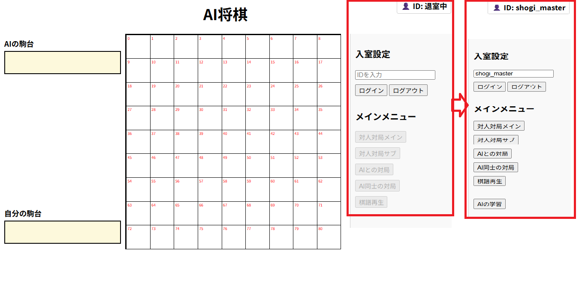
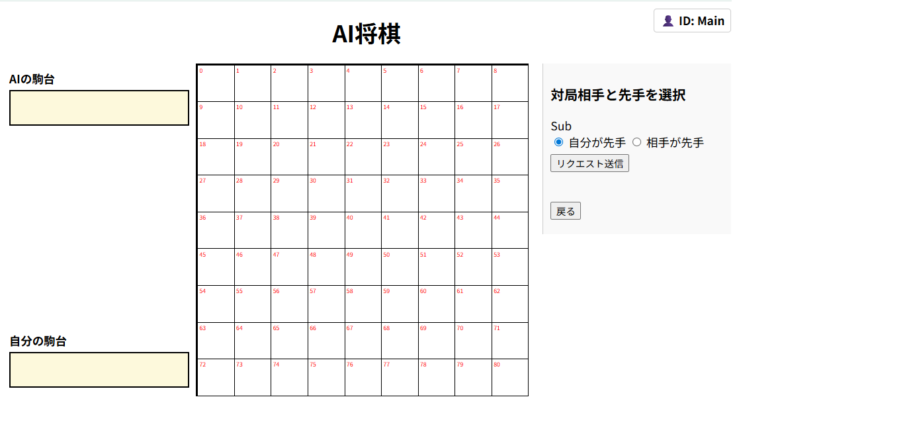
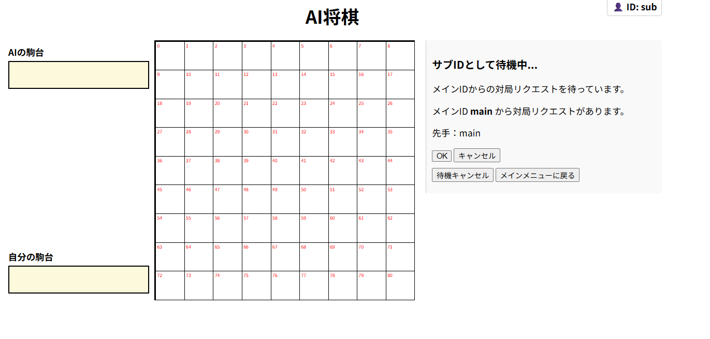
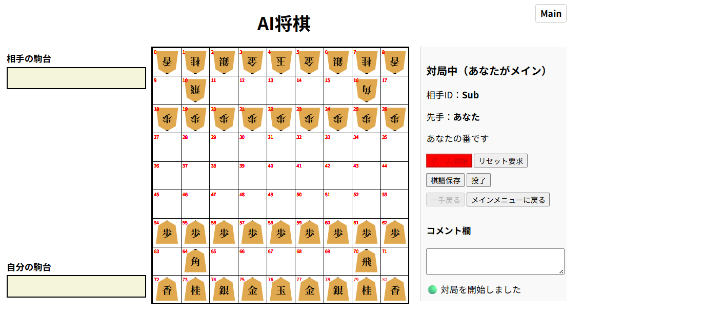
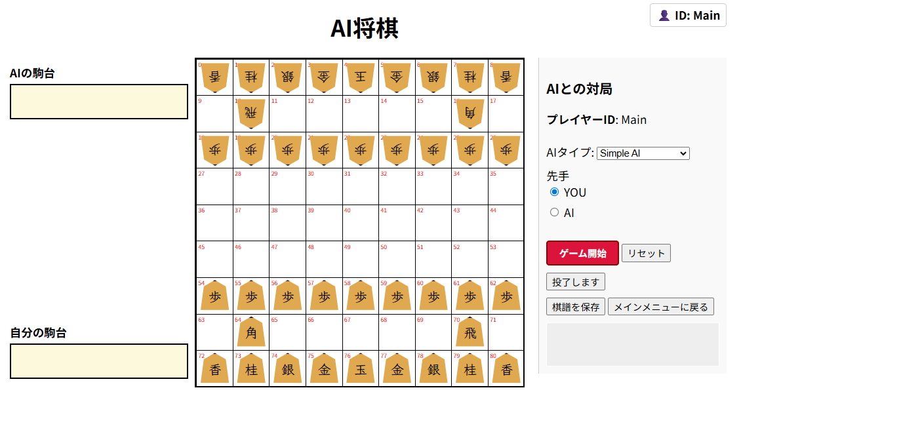
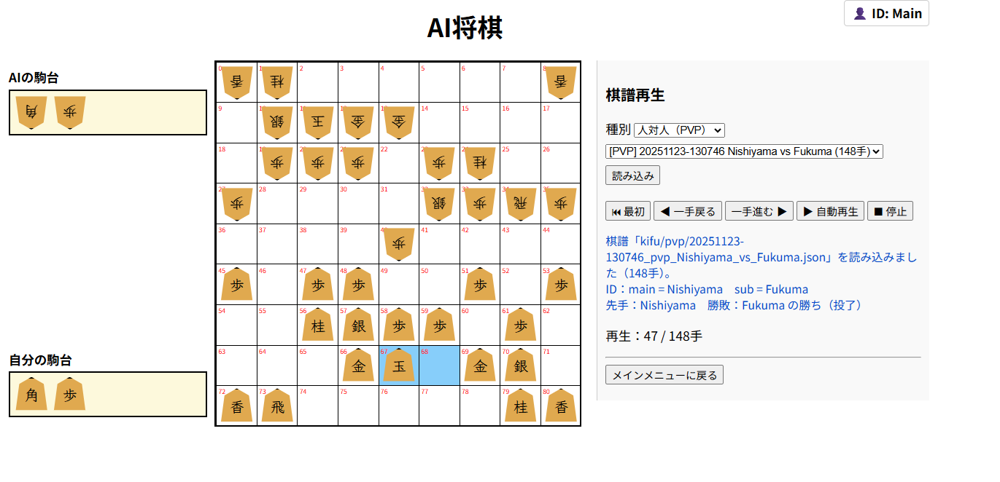
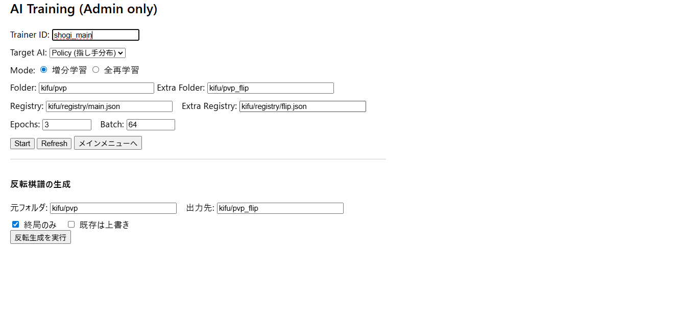

# SHOGI_NET – 操作ガイド（日本語版）

このドキュメントは、SHOGI_NET の画面操作方法と、  
各メニューのボタンの動作について説明します。

---

# 1. メインメニュー

メインメニューでは、次の機能を利用できます。

- **Human vs Human（対人対局）**
- **Human vs AI（AI 対局）**
- **Kifu Replay（棋譜再生）**
- **AI Training（AI 学習）**  

👉 [AI同士の対局]はまだ実装されていません。  

---

# 2. ログイン ID（共通）

各メニューを開始する前に、  
**ID を登録**する必要があります。

- ID は自由な文字列
- 同じ ID の重複ログインは不可
- ログイン成功するとメインメニューボタンが表示されます。

  

ログイン後、メインメニューの各項目が操作可能になります。  
👉 [AIの学習]ボタンは、IDが"shogi_master"の時だけ表示されます。

---

# 3. 対人対局

## 3-1. メイン / サブの選択

PVP（対人対局） では **メイン** と **サブ** の役割があります。  
メインとサブでボタンが分かれています。

### ● メイン（Main）  
  
- 対局を開始する側
- 待機中のサブ一覧を表示
- サブを選んで対局リクエストを送信

### ● サブ（Sub）  
  
- メインからのリクエスト待ち
- メインの対局リクエストを「OK」すると対局開始

---

## 3-2. マッチングの流れ

（例：メイン側から見た手順）

1. メニューで「対人対局メイン」を選ぶ  
2. サブで待機中の ID 一覧が表示  
3. 対戦相手を選んで「対局リクエスト」  
4. サブが「OK」すると対局準備終了 
5. 両者の画面が対局開始前の画面に遷移
6. [ゲーム開始]ボタンで下の画面になります。

  

---

## 3-3. 対局画面の見方

- 自分の駒：**画面下側・上向き**
- 相手の駒：**画面上側・下向き**
- 駒台の位置は自動で自分側に調整されます
- 盤面の同期は数秒ごとの **ポーリング方式**

---

## 3-4. 駒の動かし方

1. **動かす駒をクリック**  
2. **移動先のマスをクリック**

※ 成りの選択肢がある場合  
→ 成る / 成らない を選ぶ小さなポップアップが表示されます。

---

## 3-5. 駒台からの打ち込み

1. 駒台の駒をクリック  
2. 打ち込み先のマスをクリック  

👉 コメント欄に入力してからコマを動かすと、相手側にコメントが送信されます。

---

## 3-6. 相手からの手番通知

- 自分の番：**「あなたの番です」**
- 相手の番：**「相手が考え中です」**

---

## 3-7. リセット（対局最初に戻す）

### ● メイン側  
- 「リセットリクエスト」ボタンを押すと  
- サブ側にリクエストが送信される

### ● サブ側  
- 画面に承認ボタンが表示（点滅などで強調）  
- 承認すると盤面がリセット状態に戻る  

---

# 4. AI 対局

  

AI 対局では以下を選択できます：

- 先手 / 後手（Player / AI）
- 使用する AI：
  - simple AI  
  - minimax AI  
  - learning AI（学習モデル）  

AI の思考はサーバー側で計算され、  
完了すると即座に盤面に反映されます。

---

# 5. 棋譜再生

  

棋譜を選択すると再生モードに入ります。

### 利用可能な操作

- **最初へ戻る**  
- **一手戻る**  
- **一手進む**  
- **自動再生**（ボタンが赤くなり、進行中を表示）  
- **停止**（自動再生解除）  
- **対局に戻る**

棋譜を読み込むと、  
盤面は初期局面 → 1手目 → 2手目……と進行します。

---

# 6. AI 学習  

👉 このメニューを行うには、IDを"shogi_master"でログインする必要があります。

  

AI 学習メニューの主な機能：

### ● 増分学習（Incremental Training）
- 新しく追加された棋譜だけを学習  
- `seen_games.json` に記録される

### ● 全再学習（Full Training）
- すべての棋譜から再学習  
- 指紋（fingerprint）がクリアされ、AI は「赤ん坊状態」から再学習

### ● flip 処理
- `pvp` → `pvp_flip` へ反転棋譜を生成  
- 先手・後手の両方のデータを均等化

### ● モデル保存
- 学習が終わると自動で`models/` フォルダに `.keras` / `.h5` として保存  
- 最高性能モデルを `shogi_policy_best.keras` に保存可能  

👉 [Refresh]ボタンの機能はまだ実装されていません。

---

# 7. 各フォルダの役割（操作と関係する部分）

kifu/
ai/ AI対局の棋譜
pvp/ 人対人の元棋譜
pvp_flip/ 反転した棋譜
registry/ seen_games.json などのレジストリ
models/ AI学習後のモデル
snapshots/ 一時保存データ（今後利用予定）
static/js/ 将棋ロジック（UI）
templates/ HTML画面

---

# 8. よくある質問（FAQ）

### Q. 駒が動かない  
→ 相手の手番か確認してください。

### Q. 盤面が同期しない  
→ ポーリングが止まっている可能性  
→ 再読み込み（F5）

### Q. AI が動かない  
→ サーバー側コンソールでエラーが出ていないか確認

### Q. 棋譜が保存されない  
→ `kifu` 以下のフォルダが存在するか確認  
→ `.gitkeep` は置いたままで OK

---

# 9. 今後の予定（操作ガイド関連）
  
- UIの改善  
- バイリンガル化  
- AI対AIのメニュー実装

---

